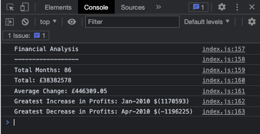

# Unit 4 Challenge: Console Finances

## Description

In this challenge I needed to implement a JavaScript operation to display the results of certain criteria from the dataset that had been provided of financial figures.

This criteria was as follows;

* The total number of months included in the dataset.

* The net total amount of Profit/Losses over the entire period.

* The average of the **changes** in Profit/Losses over the entire period.
  * You will need to track what the total change in profits are from month to month and then find the average.
  * (`Total/Number of months`)

* The greatest increase in profits (date and amount) over the entire period.

* The greatest decrease in losses (date and amount) over the entire period.

The results are to be printed to the console rather than displaying on a webpage.

## Misc
   
There was some confusion, amongst many students, about exactly what results we should be showing. After a discussion in the class it was determined that we should be showing the average of the total divided between the amount of months in the data that had been given. This is how I have gone about determining the results for this challenge

This is my first real attempt at Javascript so was coming in completely blind but have enjoyed the challenge of learning something new. It has been pleasing to see how quickly I have learnt new concepts and have very much enjoyed the ride thus far. I have found doing a lot of my own research in books and online has been of a great help in helping me complete this challenge.

I am looking forward to learning more aspects of Javascript in the coming week

### Link to work

https://tomking1983.github.io/Console-Finances/

### Screenshot of website

